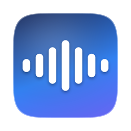
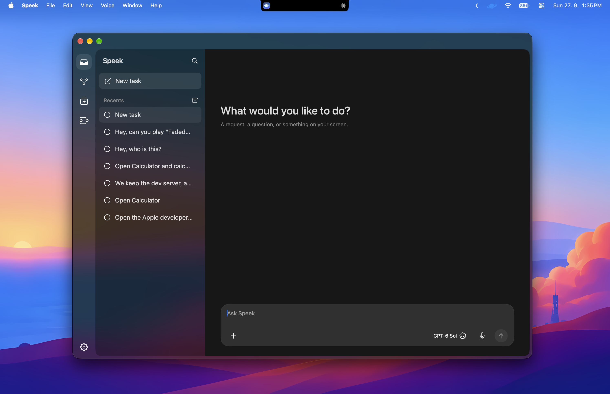
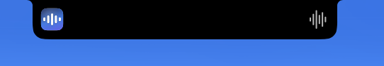
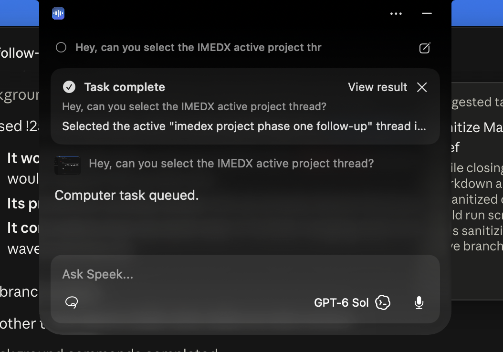
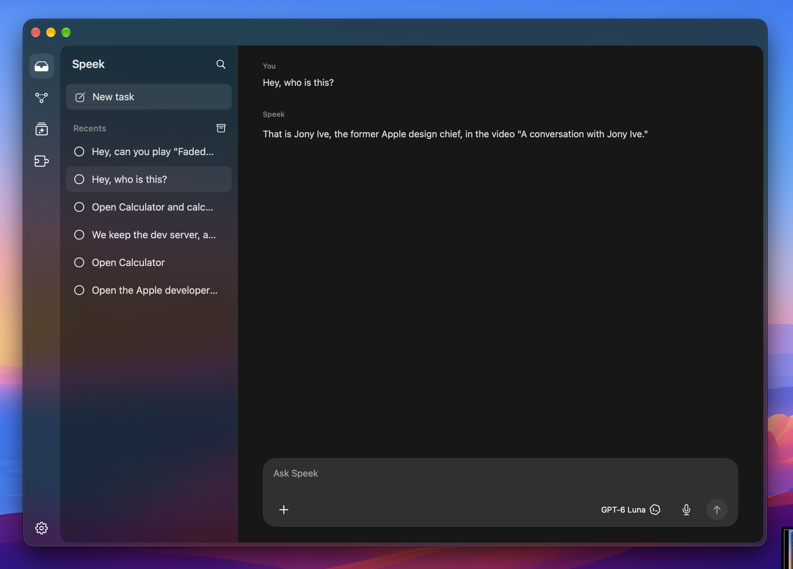
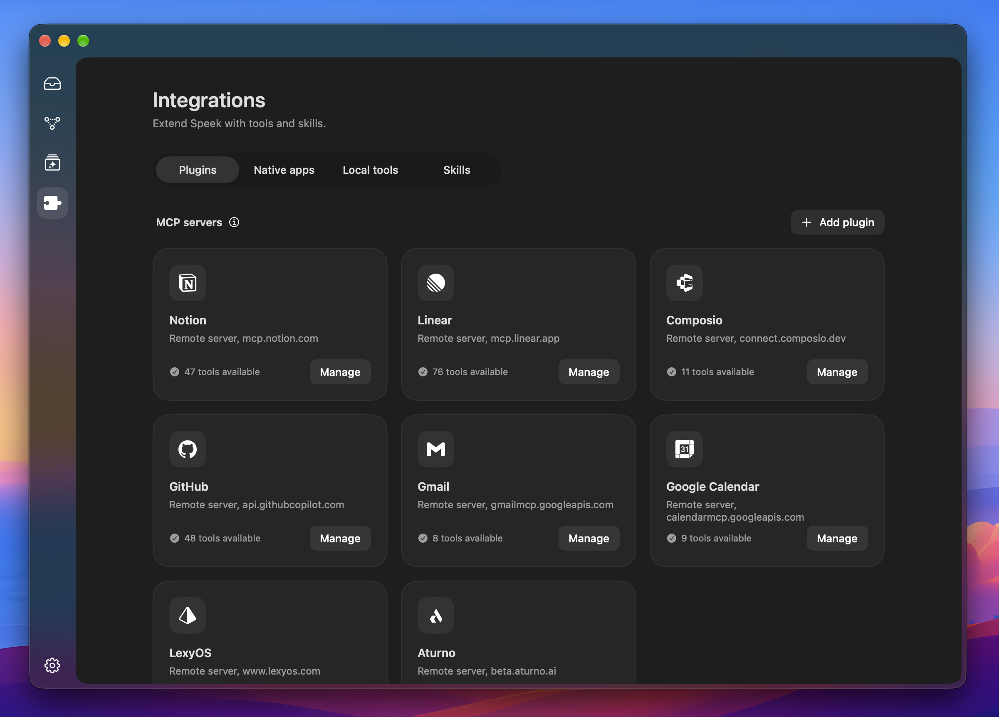
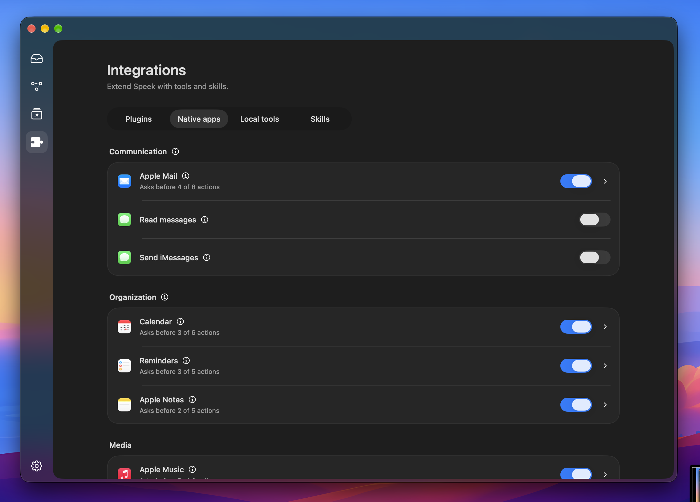
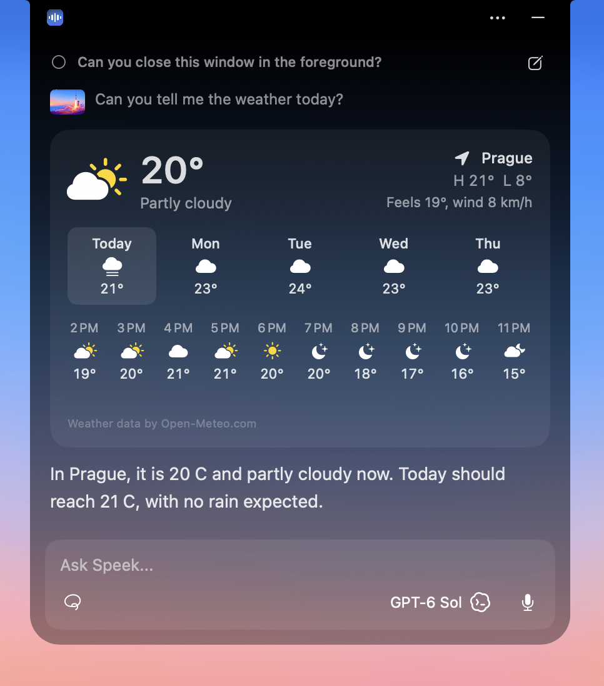
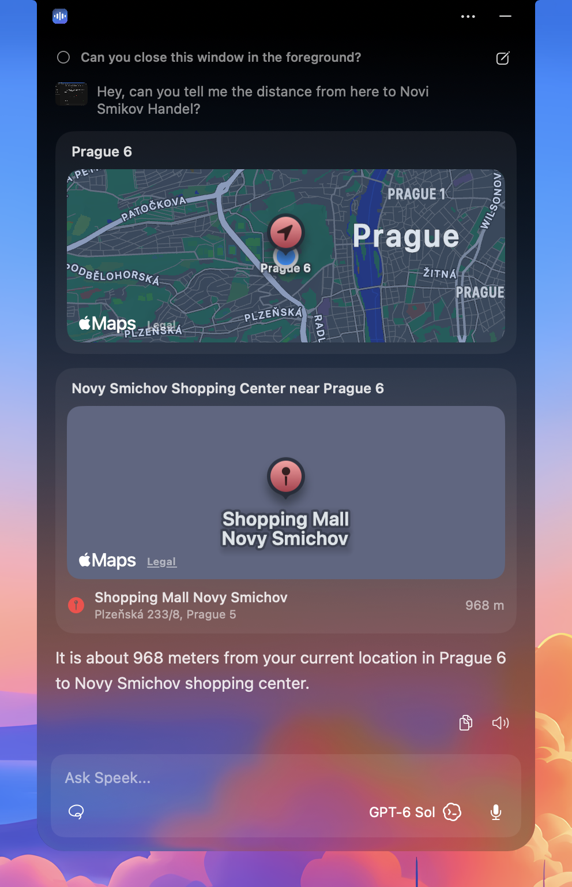
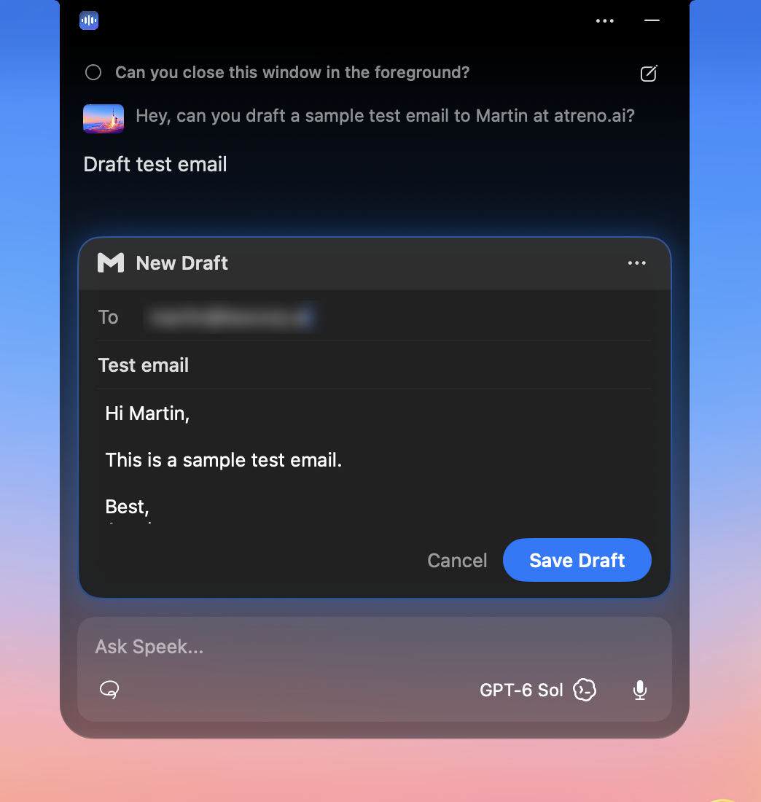

  

<h1 align="center">Speek</h1>

  <b>Talk to your Mac. It listens, writes, and gets things done.</b> 
  A voice assistant that lives in the notch.

  <a href="#what-it-does">What it does</a> &nbsp;|&nbsp;
  <a href="#showcase">Showcase</a> &nbsp;|&nbsp;
  <a href="#features">Features</a> &nbsp;|&nbsp;
  <a href="#getting-started">Getting started</a> &nbsp;|&nbsp;
  <a href="#acknowledgments">Acknowledgments</a>

  

Speek sits quietly in your Mac's notch. Hold a key and talk: it types what you say into any app, or it does what you ask, using your apps, your accounts, and whatever is on your screen. No switching windows, no copying and pasting, no hunting through menus.

## What it does

🎙️ **Write without typing.** Hold the shortcut, speak, let go. Your words land in whatever text field you are in: Mail, Slack, Notes, a browser, a terminal. Speek fits them into what is already there and can polish them into clean sentences.

👋 **Just say its name.** "Hey Speek, what's on my calendar today?" Turn on voice activation and start a request without touching the keyboard. Call it whatever you like: pick a name, and Speek answers to it. Listening happens on your Mac, and it stops recording when you stop talking.

💬 **Talk, or ask for things.** Chat with it and get a spoken answer in about a second. Or ask it to do something: "Reply to Tomas that Friday works." "Add lunch with Tomas tomorrow at noon." "Play Faded by Alan Walker." It tells you what it is doing, does it, and answers. After it speaks, just keep talking: the mic stays open for a follow-up.

👆 **Point at your screen.** Speek sees what you are looking at when you ask. To point at something specific, circle it with the pointer while you hold the shortcut. "This" then means exactly what you circled.

🧵 **Keep going while it works.** Quick requests finish in seconds, right in the notch. Longer work, like operating an app on screen, runs in the background: keep talking to Speek, and a notice appears when it is done.

🧠 **It remembers.** Say "remember my sister's name is Priya" or "remember I prefer meetings after 11". Speek keeps it and uses it when it matters. Say "forget ..." to let it go.

## Showcase

  
   At rest, Speek is part of the notch: the app you are in on the left, voice on the right.

<table>
  <tr>
    <td width="50%"></td>
    <td width="50%"></td>
  </tr>
  <tr>
    <td>A background task reports back in the notch.</td>
    <td>Every conversation is kept in the main window.</td>
  </tr>
  <tr>
    <td></td>
    <td></td>
  </tr>
  <tr>
    <td>Plugins: Gmail, Calendar, GitHub, Notion, Linear, and more.</td>
    <td>The Mac's own apps, each with its own permissions.</td>
  </tr>
</table>

**Cards, right in the notch.** Answers that are more than words come with a card you can use: the forecast for where you are, places on an Apple map, or an email you can edit before it goes.

<table>
  <tr>
    <td width="33%"></td>
    <td width="33%"></td>
    <td width="33%"></td>
  </tr>
  <tr>
    <td>"What's the weather today?" Tap a day to see its hours.</td>
    <td>"How far is the mall from here?" Your location and the place on an Apple map.</td>
    <td>"Draft an email to Martin." Edit it in place, then save or send.</td>
  </tr>
</table>

More screenshots are in the [Screenshots](Screenshots) folder.

## Features

### Dictation
- Hold-to-speak shortcut, a double-tap for hands-free, or a mouse button.
- Voice activation: say "Hey Speek", or "Hey" and any name you choose, to start a request hands-free. Recognition runs on your Mac, it understands near-misses of the name, and it stops when you stop talking.
- Raw, lightly cleaned up, or polished writing, in a style you choose.
- Writing that adapts to the app you are in and to the text around your cursor.
- Edit selected text by voice: select it, then say "make this shorter" or "translate to Czech".
- A live transcript while you speak.
- Vocabulary for names and terms, spoken shortcuts, and bulk import.
- Learns from your corrections: fix a misheard name right after dictating and Speek remembers it, with Undo.
- Several recognition languages, dictation history with one-click copy, and optional recovery of recordings that failed.

### The assistant
- A notch panel that stays out of your way, and a main window for longer conversations.
- Quick replies: conversation and questions are answered directly in about a second, and tasks start with a short spoken acknowledgment.
- Voice in, voice out: when you speak, Speek answers out loud (configurable), and the mic stays open a few seconds for a follow-up. The follow-up is checked on your Mac first, so silence costs nothing.
- Conversations start and continue on their own: a quick follow-up continues, a new topic later starts fresh.
- Computer tasks that run in the background and report back, and approvals you answer right in the notch: an email, an event, a file change, or a song appears as a card you can edit before it goes.
- Your screen with each request (you can turn it off), a circle gesture to point, and "look at my screen" on demand.
- Images, PDFs, and text files: drop or paste them into the notch.
- Answers you can copy, insert into the app you were using, or have read aloud.
- Reusable prompts, and schedules for recurring requests.
- Your choice of model and provider: OpenRouter, OpenAI, or a local Codex login.

### Your Mac and apps
- **Mail and Messages:** search, read, draft, reply, send, file, and mark messages.
- **Calendar and Reminders:** find free time, create and change events and reminders.
- **Notes:** search, read, create, and add to notes.
- **Music and Spotify:** play, pause, skip, search, playlists, and your library.
- **Media keys and volume:** play, pause, and skip in whatever is playing, and set the volume.
- **Weather and places:** "What's the weather?" uses your Mac's location and shows an interactive forecast card. "Coffee near me" shows the results on an Apple Maps card.
- **Files:** read and organize files in a working folder you choose.
- **Computer use:** when no connected tool can do something, Speek works the app on screen for you, clicking, typing, and navigating.
- **Shell:** the command-line tools you already use, such as the GitHub CLI.

### Connected services
- Plugins through the Model Context Protocol, with one-click sign-in: Gmail, Google Calendar, GitHub, Notion, Linear, LexyOS, Aturno, and hundreds more through Composio.
- Any remote or local MCP server, and your own command-line tools.
- Skills: written instructions that teach Speek how to use a tool well.
- Coding assistants: when Claude Code or Codex finishes or needs you, Speek shows it and lets you answer by voice.

### Memory
- Facts you ask it to remember, locked preferences that always apply, procedures for recurring work, and a history of past requests.
- Teach dictation by asking: "Aturno is spelled A-T-U-R-N-O" or "it keeps hearing Avik, it should be Aveek" adds the word or correction right away.
- Recall that understands meaning, not just matching words.
- Everything is visible and editable under Memory.

### Control and privacy
- For every tool, choose whether Speek asks first, just does it, or never uses it.
- Control over saved history, and dictation pauses in password fields.
- Plugin sign-ins and memory are stored on your Mac.

## Getting started

**You need** a Mac running macOS 26, and an OpenRouter or OpenAI API key. Computer use also needs Codex installed and signed in. Speek is made for the Mac only.

1. Open Speek and add your API key under **Models & Voice**.
2. Allow Microphone and Accessibility when asked. Screen Recording and app access are requested when a feature first needs them.
3. Hold the shortcut (Option-Space by default) and start talking. For hands-free, turn on **Voice activation** in Settings > General and say "Hey Speek".
4. Turn on the apps and services you want under **Integrations**.

## For developers

Speek builds with Xcode 26. `./scripts/dev-build.sh` builds, signs with the stable development identity, and installs to `/Applications/Speek.app`. Checks live in `scripts/checks/`. [Feature status](docs/FEATURE_STATUS.md) lists what is supported and known limits, and [PRD.md](PRD.md) describes current behavior.

## Acknowledgments

Speek stands on the shoulders of these open-source projects:

- [VoiceInk](https://github.com/Beingpax/VoiceInk) by Prakash Joshi Pax (GPL-3.0)
- [Whisper Pro](https://github.com/ZdenekCulik/whisper-pro) by Zdenek Culik (GPL-3.0)
- [whisper.cpp](https://github.com/ggerganov/whisper.cpp), [FluidAudio](https://github.com/FluidInference/FluidAudio), [Sparkle](https://github.com/sparkle-project/Sparkle), [swift-markdown-ui](https://github.com/gonzalezreal/swift-markdown-ui), [LaunchAtLogin-Modern](https://github.com/sindresorhus/LaunchAtLogin-Modern), [AXSwift](https://github.com/tisfeng/AXSwift), [KeySender](https://github.com/jordanbaird/KeySender), [Zip](https://github.com/marmelroy/Zip), and LLMkit, SelectedTextKit, and mediaremote-adapter by Prakash Joshi Pax
- Speech models from NVIDIA (Parakeet, Canary), OpenAI (Whisper), and Cohere, each under its own license
- Avo by Aristu Sachdev, studied as an interaction reference

## License

Speek is free software under the [GNU General Public License v3.0](LICENSE).
